---
## Front matter
lang: ru-RU
title: Лабораторная работа № 9
subtitle: Операционные системы
author:
  - Перегудов А.В.
institute:
  - Российский университет дружбы народов, Москва, Россия
date: 6 апреля 2024

## i18n babel
babel-lang: russian
babel-otherlangs: english

## Fonts
mainfont: PT Serif
romanfont: PT Serif
sansfont: PT Sans
monofont: PT Mono
mainfontoptions: Ligatures=TeX
romanfontoptions: Ligatures=TeX
sansfontoptions: Ligatures=TeX,Scale=MatchLowercase
monofontoptions: Scale=MatchLowercase,Scale=0.9

## Formatting pdf
toc: false
toc-title: Содержание
slide_level: 2
aspectratio: 169
section-titles: true
theme: metropolis
header-includes:
 - \metroset{progressbar=frametitle,sectionpage=progressbar,numbering=fraction}
 - '\makeatletter'
 - '\beamer@ignorenonframefalse'
 - '\makeatother'
---

# Информация

## Докладчик

  * Перегудов Александр Вадимович
  * Студент группы НКАбд-04-23
  * Российский университет дружбы народов
  * [1132239659@pfur.ru]
  * <https://github.com/magister6239/study_2023-2024_os-intro>

# Вводная часть

Командная оболочка Midnight Commander

## Актуальность

- Midnight Commander являеться одной из самых распростронённых командных оболочек.
- Midnight Commander позволяет выполнять широкий список задач.

## Объект и предмет исследования

- Midnight Commander

## Цели и задачи

Освоение основных возможностей командной оболочки Midnight Commander. Приобретение навыков практической работы по просмотру каталогов и файлов; манипуляций с ними.

## Материалы и методы

- Процессор `pandoc` для входного формата Markdown
- Результирующие форматы
	- `pdf`
	- `html`
- Автоматизация процесса создания: `Makefile`

# Создание презентации

## Вызов справки для команды man

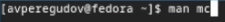{width=70%}

{width=70%}

## Запуск Midnight commander

{width=70%}

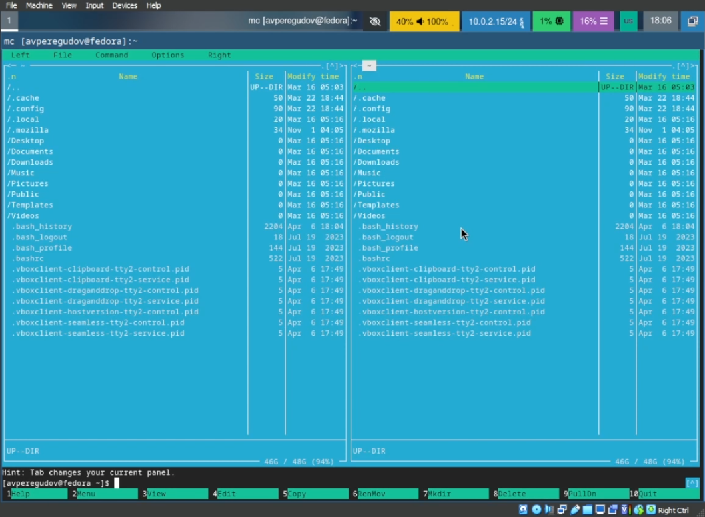{width=70%}

## Создание файла file.txt

{width=70%}

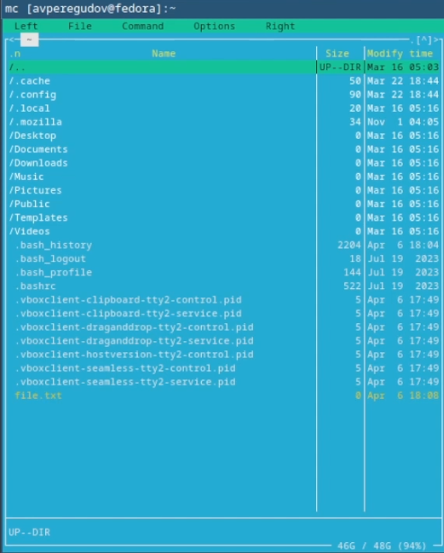{width=70%}

## Редактирование файла file.txt

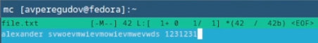{width=70%}

## Копирование файла file.txt

{width=70%}

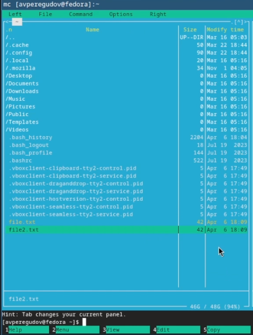{width=70%}

## Копирование файла file.txt

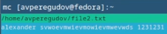{width=70%}

## Перемещение file2.txt

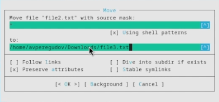{width=70%}

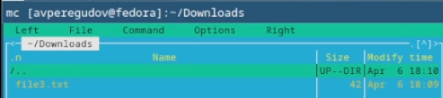{width=70%}

## Перемещение file2.txt

{width=70%}

## Chown

{width=70%}

## Chown

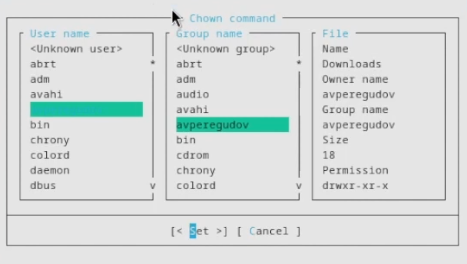{width=70%}

## Chown

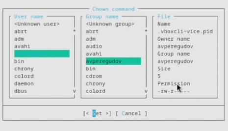{width=70%}

## Основные команды меню левой панели

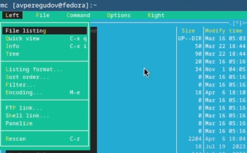{width=70%}

## Основные команды меню левой панели

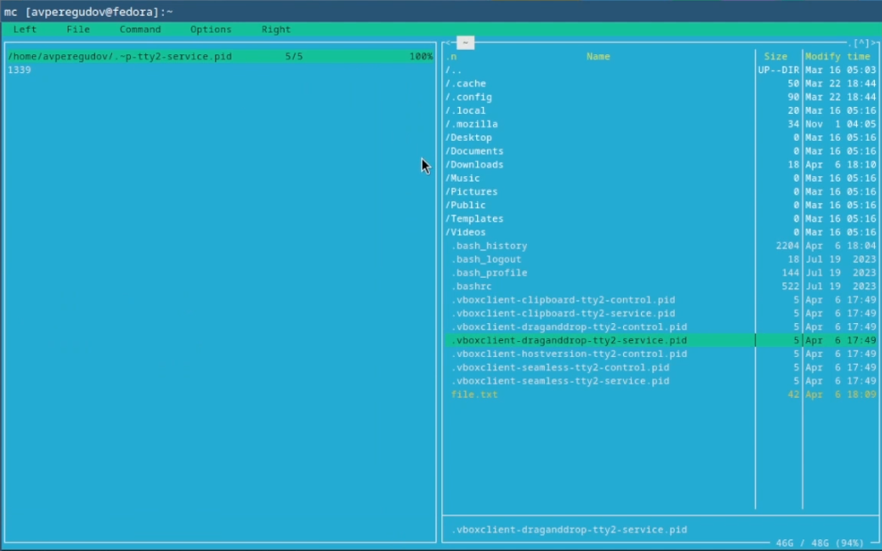{width=70%}

## Основные команды меню левой панели

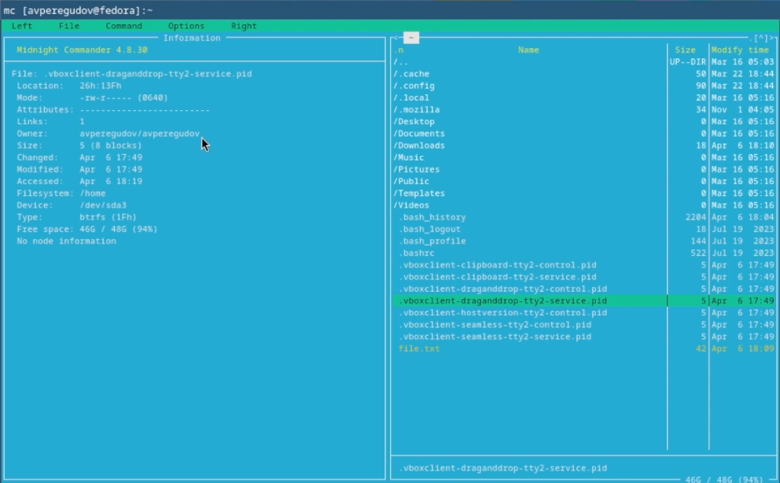{width=70%}

## Основные команды меню левой панели

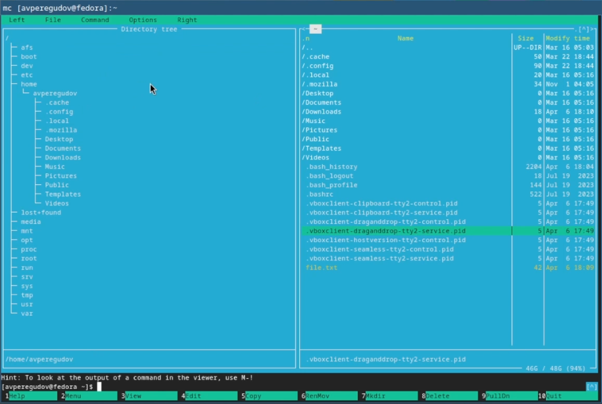{width=70%}

## View

{width=70%}

## View

{width=70%}

## Edit

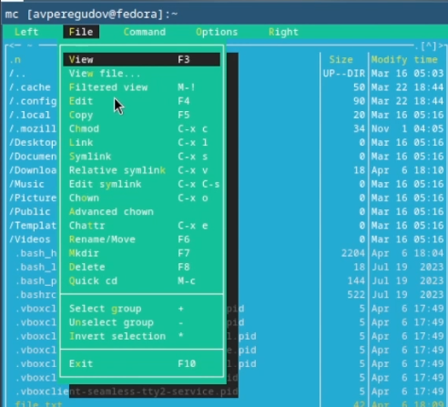{width=70%}

## Edit

{width=70%}

{width=70%}

## Mkdir

{width=70%}

## Mkdir

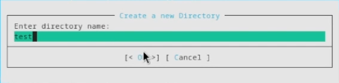{width=70%}

## Copy

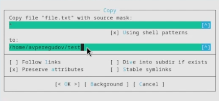{width=70%}

## Find file

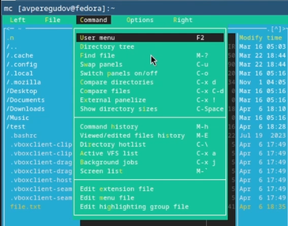{width=70%}

## Find file

{width=70%}

## Find file

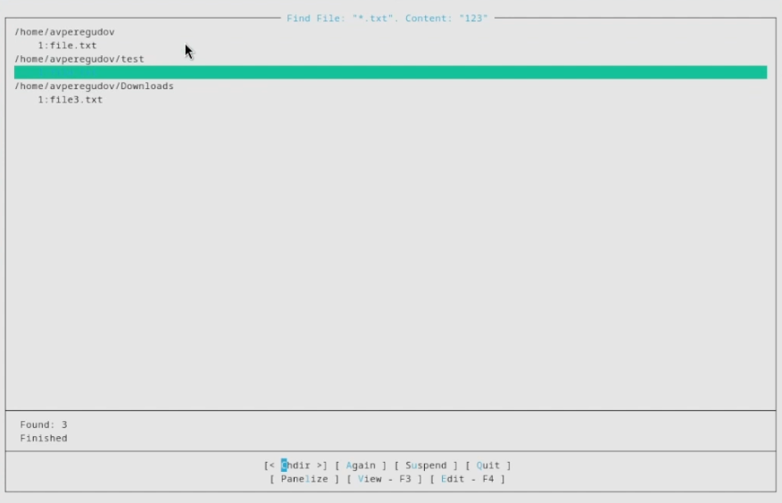{width=70%}

## Command history

{width=70%}

## Command history

{width=70%}

## Command history

{width=70%}

## Command history

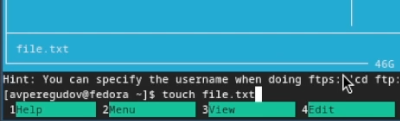{width=70%}

## Switch panels

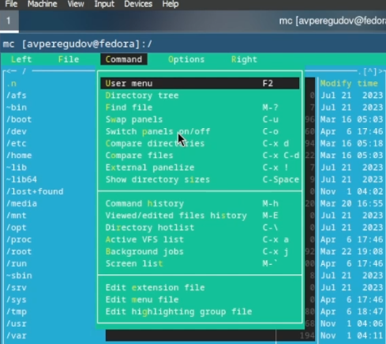{width=70%}

## Switch panels

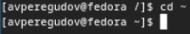{width=70%}

## Файл меню

{width=70%}

## Файл меню

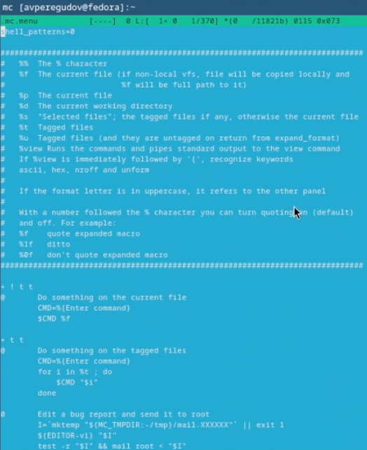{width=70%}

## Файл расширений

{width=70%}

## Options

{width=70%}

## Options

{width=70%}

## Options

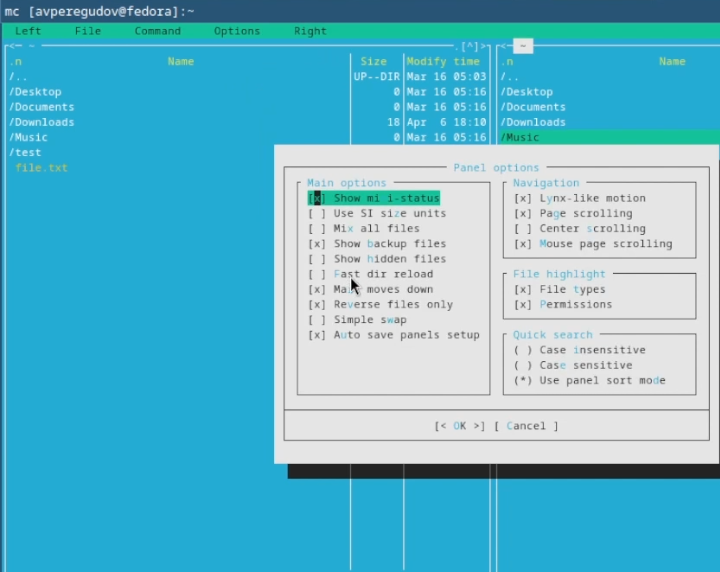{width=70%}

## Options

{width=70%}

## Копирование

{width=70%}

{width=70%}

## Манипуляции с текстом

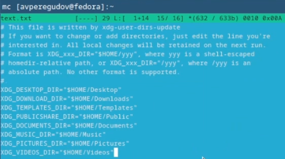{width=70%}

## Манипуляции с текстом

{width=70%}

## Подстветка синтаксиса

{width=70%}

## Подстветка синтаксиса

{width=70%}

## Подстветка синтаксиса

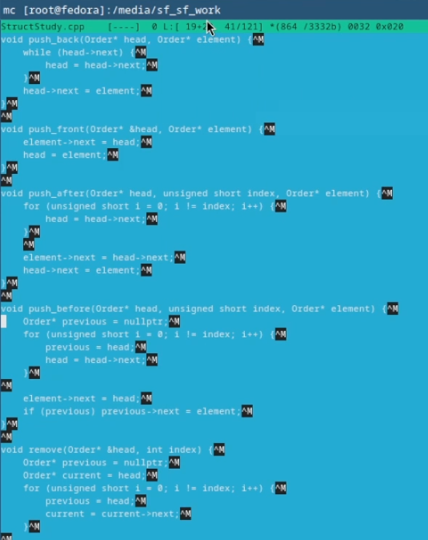{width=70%}
