---
## Front matter
title: "Лабораторная работа № 9"
subtitle: "Операционные системы"
author: "Перегудов Александр Вадимович"

## Generic otions
lang: ru-RU
toc-title: "Содержание"

## Bibliography
bibliography: bib/cite.bib
csl: pandoc/csl/gost-r-7-0-5-2008-numeric.csl

## Pdf output format
toc: true # Table of contents
toc-depth: 2
lof: true # List of figures
lot: true # List of tables
fontsize: 12pt
linestretch: 1.5
papersize: a4
documentclass: scrreprt
## I18n polyglossia
polyglossia-lang:
  name: russian
  Options:
	- spelling=modern
	- babelshorthands=true
polyglossia-otherlangs:
  name: english
## I18n babel
babel-lang: russian
babel-otherlangs: english
## Fonts
mainfont: PT Serif
romanfont: PT Serif
sansfont: PT Sans
monofont: PT Mono
mainfontoptions: Ligatures=TeX
romanfontoptions: Ligatures=TeX
sansfontoptions: Ligatures=TeX,Scale=MatchLowercase
monofontoptions: Scale=MatchLowercase,Scale=0.9
## Biblatex
biblatex: true
biblio-style: "gost-numeric"
biblatexoptions:
  - parentracker=true
  - backend=biber
  - hyperref=auto
  - language=auto
  - autolang=other*
  - citestyle=gost-numeric
## Pandoc-crossref LaTeX customization
figureTitle: "Рис."
tableTitle: "Таблица"
listingTitle: "Листинг"
lofTitle: "Список иллюстраций"
lotTitle: "Список таблиц"
lolTitle: "Листинги"
## Misc Options
indent: true
header-includes:
  - \usepackage{indentfirst}
  - \usepackage{float} # keep figures where there are in the text
  - \floatplacement{figure}{H} # keep figures where there are in the text
---

# Цель работы

Освоение основных возможностей командной оболочки Midnight Commander. Приобретение навыков практической работы по просмотру каталогов и файлов; манипуляций с ними.

# Задание

# Теоретическое введение

Здесь описываются теоретические аспекты, связанные с выполнением работы.

Например, в табл. [-@tbl:std-dir] приведено краткое описание стандартных каталогов Unix.

: Описание некоторых каталогов файловой системы GNU Linux {#tbl:std-dir}

| Имя каталога | Описание каталога                                                                                                          |
|--------------|----------------------------------------------------------------------------------------------------------------------------|
| `/`          | Корневая директория, содержащая всю файловую                                                                               |
| `/bin `      | Основные системные утилиты, необходимые как в однопользовательском режиме, так и при обычной работе всем пользователям     |
| `/etc`       | Общесистемные конфигурационные файлы и файлы конфигурации установленных программ                                           |
| `/home`      | Содержит домашние директории пользователей, которые, в свою очередь, содержат персональные настройки и данные пользователя |
| `/media`     | Точки монтирования для сменных носителей                                                                                   |
| `/root`      | Домашняя директория пользователя  `root`                                                                                   |
| `/tmp`       | Временные файлы                                                                                                            |
| `/usr`       | Вторичная иерархия для данных пользователя                                                                                 |

Более подробно про Unix см. в [@tanenbaum_book_modern-os_ru; @robbins_book_bash_en; @zarrelli_book_mastering-bash_en; @newham_book_learning-bash_en].

# Выполнение лабораторной работы

Открыл справку Midnight Commander (рис. [-@fig:001], [-@fig:002]).

{#fig:001 width=70%}

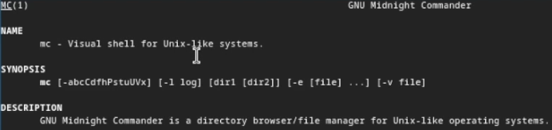{#fig:002 width=70%}

Запустил Midnight Commander (рис. [-@fig:099], [-@fig:003]).

{#fig:099 width=70%}

{#fig:003 width=70%}

Создал файл file.txt (рис. [-@fig:004], [-@fig:005]).

{#fig:004 width=70%}

{#fig:005 width=70%}

Отредактировал файл file.txt (рис. [-@fig:006]).

{#fig:006 width=70%}

Скопировал файл file.txt как файл file2.txt (рис. [-@fig:007], [-@fig:008]).

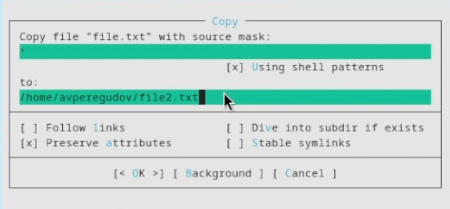{#fig:007 width=70%}

{#fig:008 width=70%}

Отредактировал файл file2.txt (рис. [-@fig:009]).

{#fig:009 width=70%}

Скопировал файл file2.txt как файл file3.txt в папку Download (рис. [-@fig:010], [-@fig:011]).

{#fig:010 width=70%}

{#fig:011 width=70%}

Отредактировал файл file3.txt (рис. [-@fig:012]).

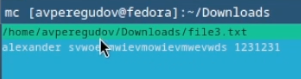{#fig:012 width=70%}

Открыл подменю file и использовал опцию chown для одной директории и одного файла (рис. [-@fig:013], [-@fig:014], [-@fig:015]).

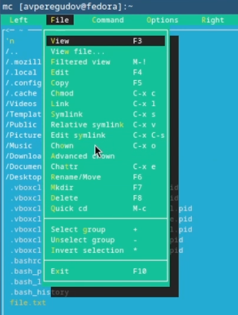{#fig:013 width=70%}

{#fig:014 width=70%}

{#fig:015 width=70%}

Открыл подменю Left (рис. [-@fig:016]).

{#fig:016 width=70%}

Использовал опции Quick view, Info, Tree (рис. [-@fig:017] [-@fig:018], [-@fig:019]).

{#fig:017 width=70%}

{#fig:018 width=70%}

{#fig:019 width=70%}

Открыл подменю file и использовал опцию View (рис. [-@fig:020], [-@fig:021]).

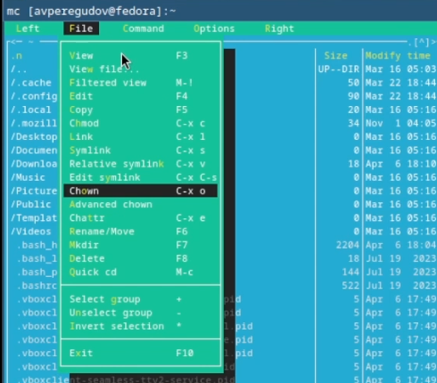{#fig:020 width=70%}

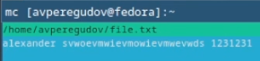{#fig:021 width=70%}

Открыл подменю file и использовал опцию Edit  (рис. [-@fig:022], [-@fig:023]).

{#fig:022 width=70%}

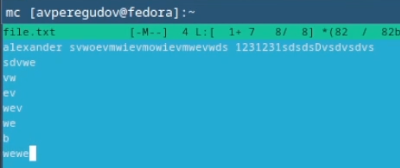{#fig:023 width=70%}

Вышел из редактора без сохранения (рис. [-@fig:024]).

{#fig:024 width=70%}

Открыл подменю file и использовал опцию Mkdir и создал директорию test (рис. [-@fig:025], [-@fig:026]).

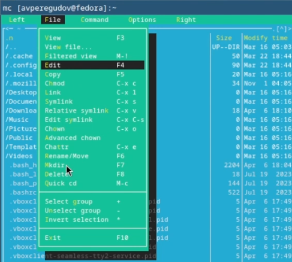{#fig:025 width=70%}

{#fig:026 width=70%}

Скопировал файл file.txt в папку test (рис. [-@fig:027]).

{#fig:027 width=70%}

Открыл подменю Command и использовал опцию Find file (рис. [-@fig:028]).

{#fig:028 width=70%}

Открыл подменю Command и нашёл файлы по определённым критериям (рис. [-@fig:029], [-@fig:030]).

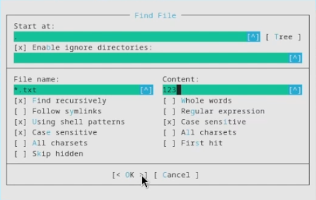{#fig:029 width=70%}

{#fig:030 width=70%}

Удалил файл file.txt (рис. [-@fig:032]).

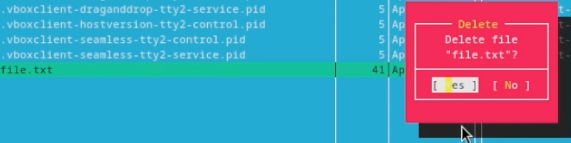{#fig:032 width=70%}

Открыл подменю Command и использовал опцию Command history (рис. [-@fig:031],  [-@fig:033]).

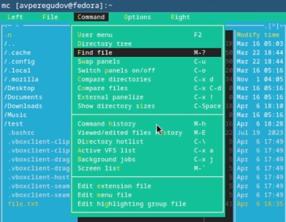{#fig:031 width=70%}

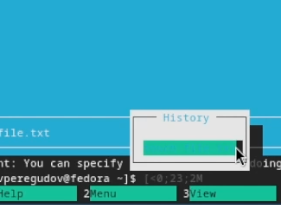{#fig:033 width=70%}

Использовал touch при помощи команды history (рис. [-@fig:034]).

{#fig:034 width=70%}

Открыл подменю Command и выключил панели для ввода команды (рис. [-@fig:035]).

{#fig:035 width=70%}

Ввёл команду для cd ~ для перехода в домашний каталог (рис. [-@fig:036]).

{#fig:036 width=70%}

Открыл подменю Command (рис. [-@fig:037]).

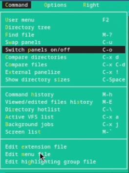{#fig:037 width=70%}

Открыл файл меню (рис. [-@fig:038]).

{#fig:038 width=70%}

Открыл файл расширений (рис. [-@fig:039]).

{#fig:039 width=70%}

Открыл подменю Options (рис. [-@fig:040]).

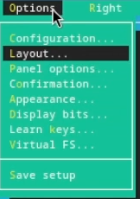{#fig:040 width=70%}

Изменил некоторые опции в меню Layout (рис. [-@fig:041]).

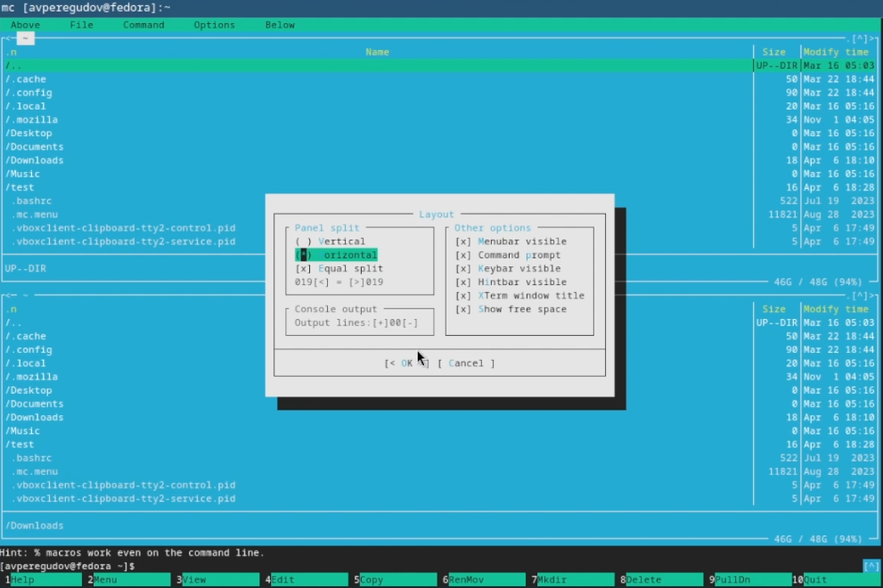{#fig:041 width=70%}

Изменил некоторые опции в меню Panel options (рис. [-@fig:042]).

{#fig:042 width=70%}

Изменил некоторые опции в меню Confirmation (рис. [-@fig:043]).

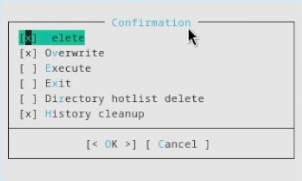{#fig:043 width=70%}

Создал файл file.txt (рис. [-@fig:044]).

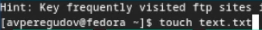{#fig:044 width=70%}

Скопировал текст из случайного файла в файл file.txt (рис. [-@fig:045]).

{#fig:045 width=70%}

Открыл файл file.txt (рис. [-@fig:046]).

{#fig:046 width=70%}

Отредактировал файл и сохранил его (рис. [-@fig:047]).

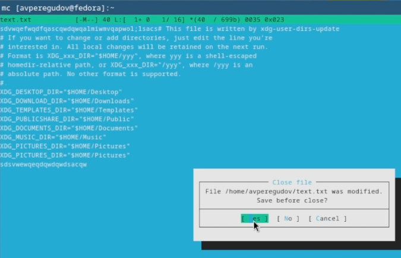{#fig:047 width=70%}

Открыл файл с исходным текстом на c++ (рис. [-@fig:048]).

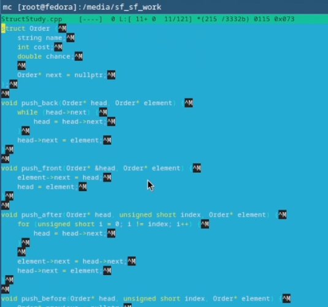{#fig:048 width=70%}

Выключил подсветку синтаксиса для c++ (рис. [-@fig:049], [-@fig:050]).

{#fig:049 width=70%}

{#fig:050 width=70%}

# Выводы

Освоение основных возможностей командной оболочки Midnight Commander. Приобретение навыков практической работы по просмотру каталогов и файлов; манипуляций с ними.

Были освоены основные возможности командной оболочки Midnight Commander. Также были приобретенны навыки практической работы по просмотру каталогов, файлов и манипуляций с ними.

# Список литературы{.unnumbered}

::: {#refs}
:::
